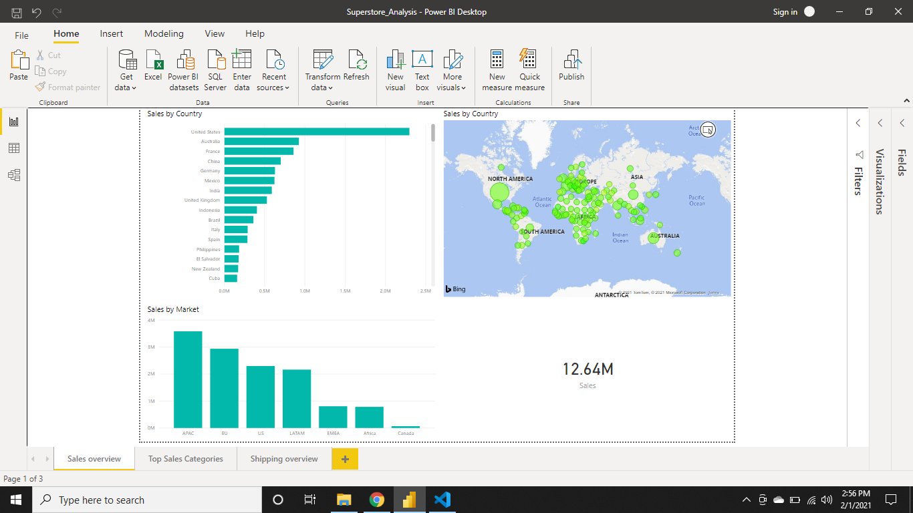
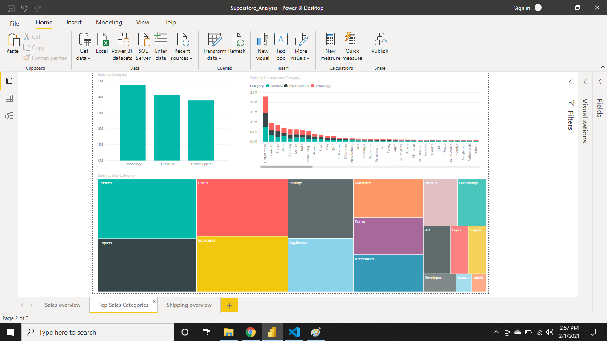
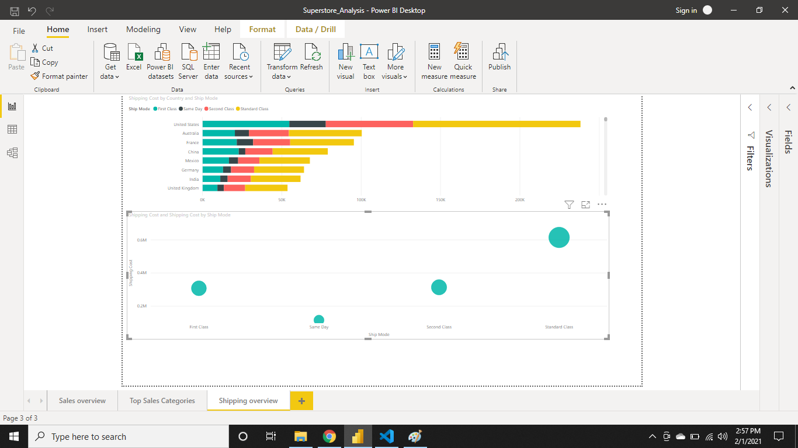

# Superstore Analysis

## Objective

We are going to perform some exploratory Analysis on this data set. Mainly using PowerBi to generate insights and visuals for understading historical business outcomes.

First Report shows Global Sales and Country and regional breakdown or Earnings.

Second Report Focuses on Different categories and subcategories

Third Report looks at shipping costs associates with each category and country.
